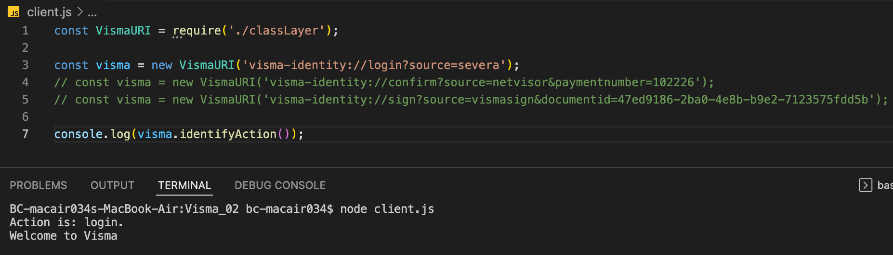

# Visma Solutions - programming task

Specifications of the assignment below in section _Assignment Specs_

# Technologies used

Built with:

- JS
- Nodejs

## Setup and usage

1. Make sure you have installed nodejs and npm (https://docs.npmjs.com/downloading-and-installing-node-js-and-npm)

2. Install uuid dependencies with:

```shell
   npm install
```

3. Uncomment the case you want to test in main.js. By default the following one is uncommented.

```js
const visma = new VismaURI("visma-identity://login?source=severa");
```

4. Runs the app in the development mode.

```shell
node client.js
```

5. Swap between URI cases (allocated in the constant `visma`), uncommenting/commenting them in order to test them. Note that only one case can be tested at once.

6. Tasks analysis and my own thoughts can be found in file [taskAnalysis.md](./taskAnalysis.md)

## Screenshots

 "Main View"

## Documentation used

- PARSE URL: https://nodejs.org/dist/latest-v16.x/docs/api/url.html

- URL searchParam: https://developer.mozilla.org/en-US/docs/Web/API/URL/searchParams

- UUID validation: https://www.npmjs.com/package/uuid

## Authors and acknowledgment

Abel Parada

- [GitHub @abel-parada](https://github.com/abel-parada)
- [LinkedIn](https://www.linkedin.com/in/abelparadamillan/)

---

## Assignment Specs

**Problem**
Visma Solutions Oy is developing an application for identity management. With the application, users can login to integrated applications, confirm payments and sign documents. Identity management is a mobile application and other apps can call its services through deep linking. We have decided to outsource implementation of this application.

We have found you as the subcontractor to design and implement a part of the applications logic.

## Task

Your task is to design and implement a class which is responsible for identifying what kind of requests it receives. Others can call the identity app using the scheme visma-identity. When this scheme is used, the application opens automatically and processes the string that calls it. Your first task is to design and implement a class which handles this string.

## Uri consists of three parts:

visma-identity://login?source=severa

- Scheme: visma-identity
- Path(action): login
- Parameters: source=severa

The class needs to satisfy the following requirements:

- It takes the following information as input
  - URI that calls the application(type: string)
- It has to parse and validate that:
  - Used URI scheme is right: visma-identity
  - Action(path) is one of the allowed: login, confirm or sign
  - All parameters which are mandatory for action are valid
- Requirements for the parameters:
  - Action login
    - source(type:string)
  - Action confirm
    - source(type:string)
    - payment number(type:string)
  - Action sign
    - source(type: string)
    - documentid(type: UUID)
- Class returns action
- Class returns parameter value for the key
- It is designed using the practises of object oriented programming
- The class is intended for use in the mobile application, BUT it doesn’t have to have any mobile specific code, just handling of the string parameter.
- Implementation needs to have a client, which uses the new class. It can be a console app for example.
- Example URI’s for different actions:
  - visma-identity://login?source=severa
  - visma-identity://confirm?source=netvisor&paymentnumber=102226
  - visma-identity://sign?source=vismasign&documentid=47ed9186-2ba0-4e8b-b9e2-7123575fdd5b
